# Continuity Lab

Continuity Lab is an original, local, educational reinterpretation of public disposable-node Git/WAL ideas. It is **not affiliated with Cursor**, is not an official Cursor product, and contains no proprietary Cursor code. It is a laboratory, not an Internet-facing production service.

Three Git nodes serve real `git clone`, `fetch`, and `push` over Smart HTTP. None of them is authoritative. Object storage holds the only durable truth, and a push becomes visible when exactly one conditional write wins.

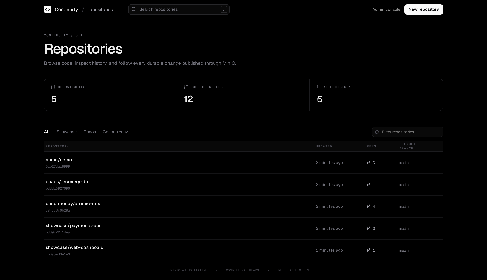

## Architecture

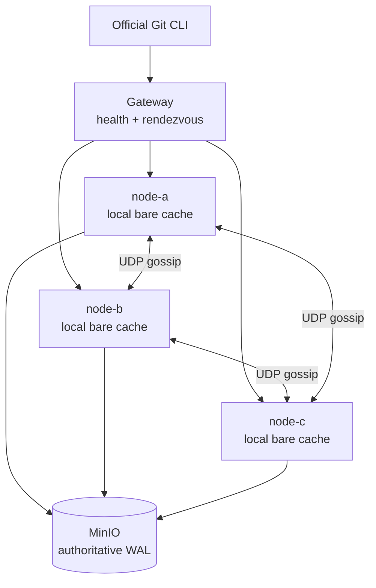

Three processes do not by themselves provide replication. Here every node has an independent volume, while MinIO stores the authoritative manifest, exact visible refs, immutable normalized packs, ordered immutable WAL, and complete snapshots. Local repositories are reconstructible caches.

**Correctness:** conditional GET establishes read freshness; a real `PUT If-Match` of `head.json` serializes writes. **Speed:** rendezvous locality, warm Git caches, and HMAC-authenticated UDP gossip. Gossip may be dropped, duplicated, or reordered because a recipient always rereads MinIO.

CAS avoids a mandatory correctness leader: all nodes may prepare writes against the same ETag, but only one replacement wins. Same-ref losers become stale; independent-ref losers catch up and retry in the next serial position.

## Push and read flows

A push runs the official `git-http-backend` and Git hooks. `pre-receive` normalizes quarantine objects into a non-thin pack and uploads it. `proc-receive` prepares one `git update-ref --stdin` transaction, uploads an immutable WAL candidate, and CAS-replaces `head.json`. It commits local refs and reports success only after CAS. A post-CAS disconnect is an uncertain client result but an authoritative commit.

Clone/fetch checks `head.json` during both `info/refs` and upload-pack POST. A missing cache restores a snapshot and replays the committed tail. A changed cache replays WAL. Final refs and Git connectivity must match before serving.

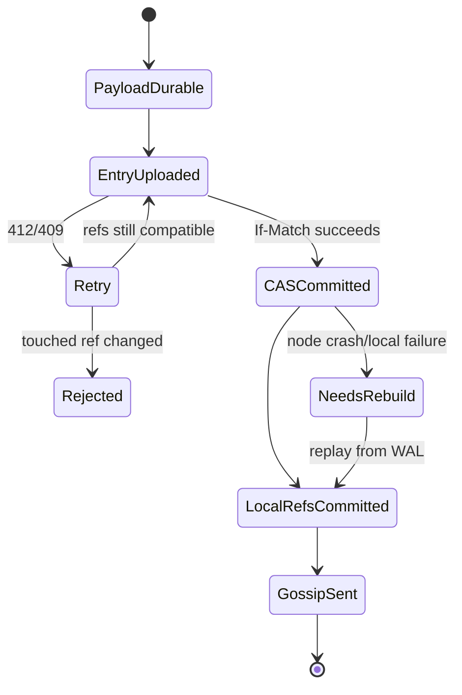

## Requirements and quick start

- Docker with Compose v2
- host Git
- Go 1.26.x for host builds (containers pin Go 1.26.7)
- Node.js 24 and npm for host UI builds (the container build supplies its own Node stage)

```sh
make bootstrap
./bin/continuityctl repo create acme/demo
git clone http://localhost:8080/git/acme/demo.git
make demo
make test-all
```

Services bind to loopback: gateway 8080, MinIO 9000/9001, and direct nodes 18081–18083. Development credentials are intentionally insecure and must never be reused.

## Continuity Git — the repository explorer

Open **<http://localhost:8080>**. The React explorer creates and lists repositories, browses branches, tags, directories, and files, and previews README documents. The production bundle is embedded in the gateway binary; `/api/v1` and `/git` retain their existing routes.

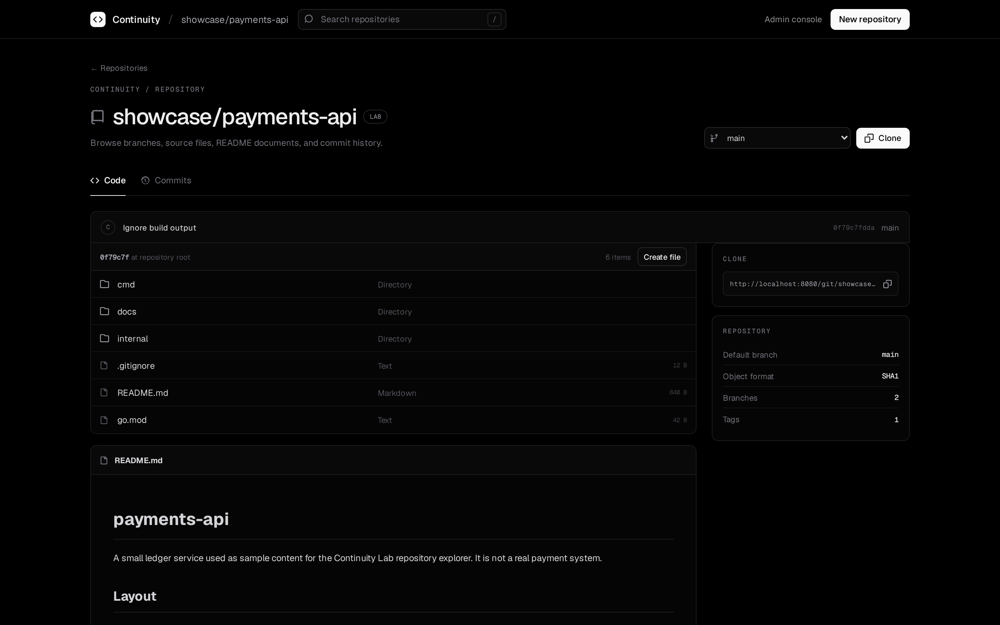

Files are served from the same authoritative state a `git clone` would see. Nothing is rendered from a local cache that has not been revalidated against MinIO first.

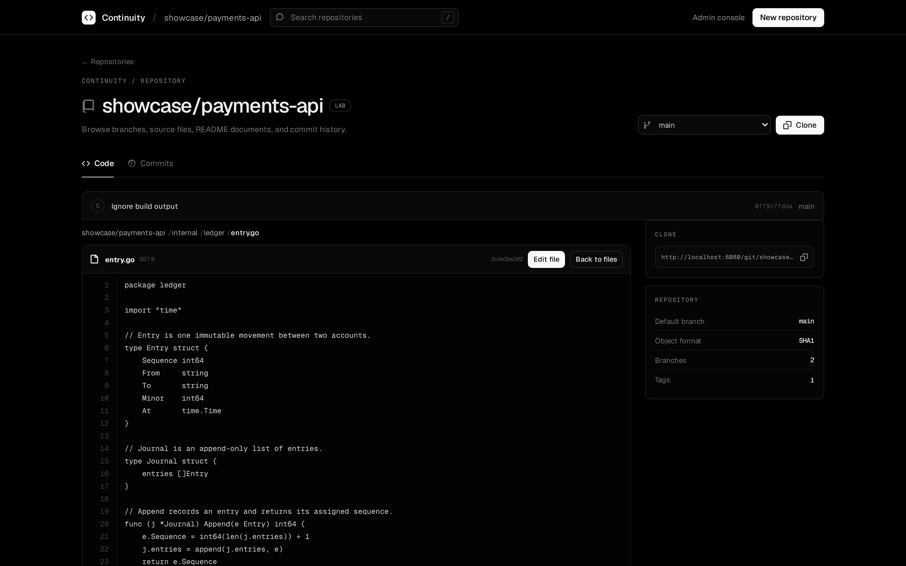

Commit history and commit details are read through the node's Git object database after `EnsureFresh` confirms the cache matches `head.json`.

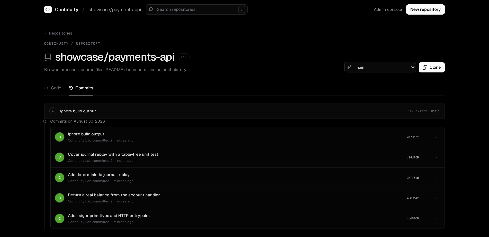

A lazy-loaded CodeMirror editor creates or edits UTF-8 files. Web edits commit directly to the selected branch with optimistic base-OID checks, and they are published through real Smart HTTP, real hooks, the WAL, and the same `head.json` CAS as any external client. A stale base OID returns HTTP 409.

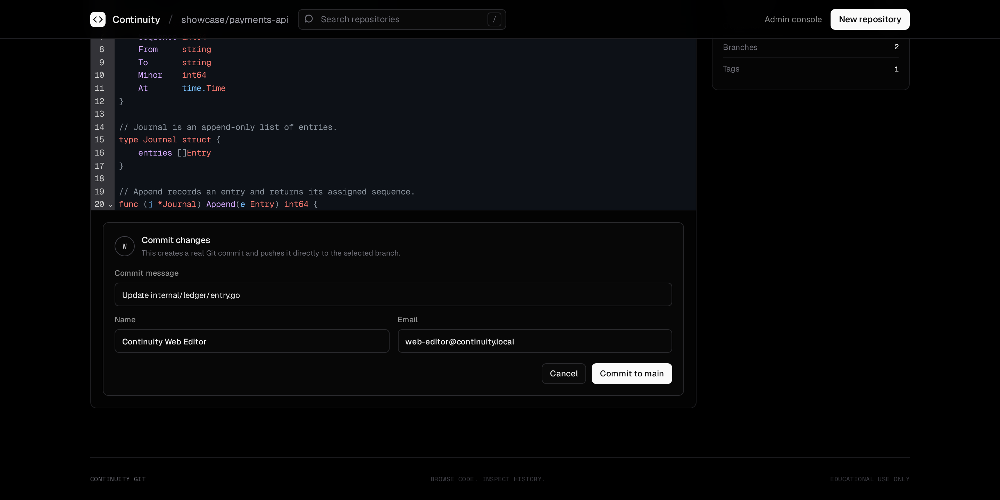

## Continuity Admin — the operations console

Operational concerns are intentionally separated into the read-only console at **<http://localhost:8080/admin>**. It shows real gateway node health, aggregate authoritative WAL history, and logical MinIO repository records — no mutating actions are exposed.

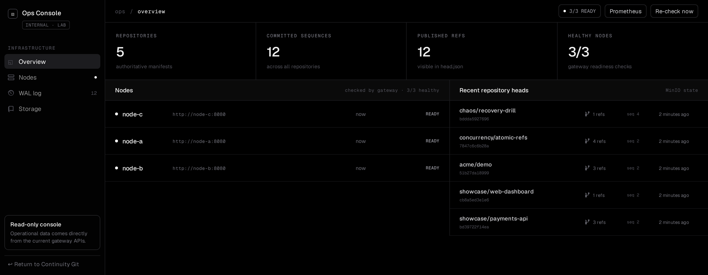

Every node is an independent, disposable cache. Any of them can be evicted or destroyed and rebuilt from a snapshot plus the committed WAL tail.

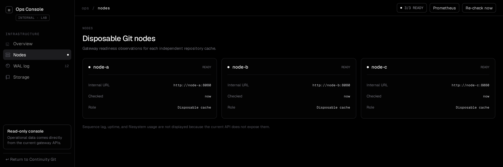

The WAL view is the clearest picture of how the system commits: one global sequence per repository, the exact ref updates each entry published, and which node won the CAS that made it visible.

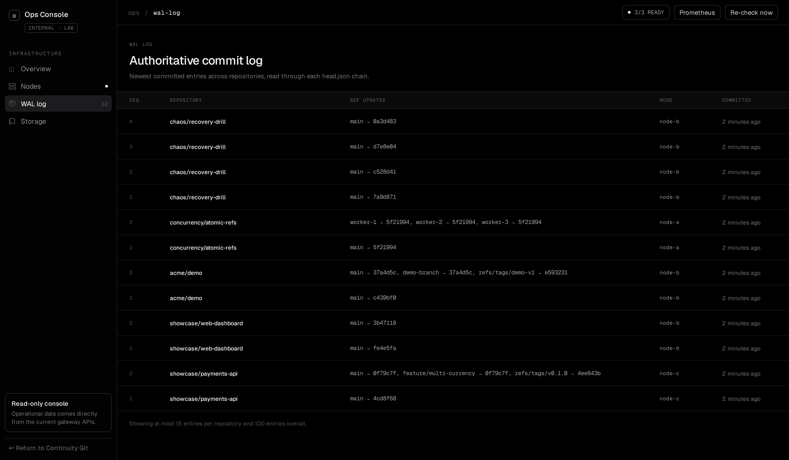

Storage shows the logical durable records — one immutable `manifest.json` per repository, one mutable `head.json` replaced only through CAS, and the committed WAL history behind them.

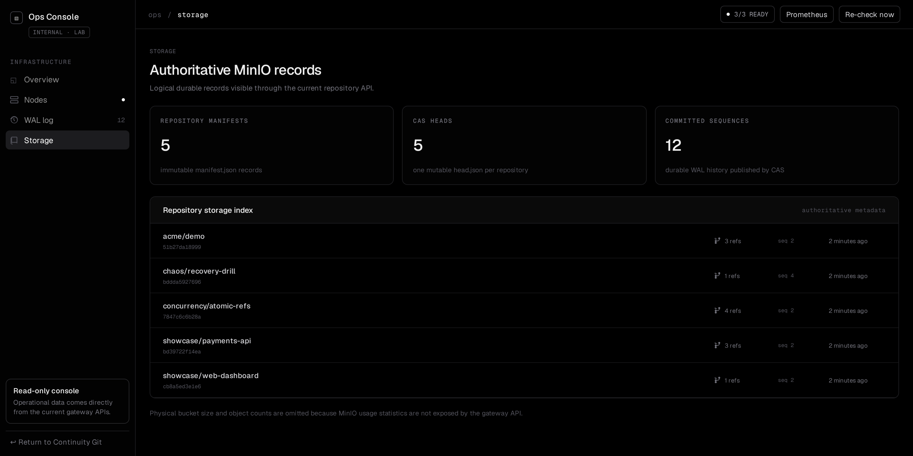

## Manual Git demo

```sh
./bin/continuityctl repo create acme/demo
tmp="$(mktemp -d)"
git init -b main "$tmp/source"
git -C "$tmp/source" config user.name 'Continuity Lab'
git -C "$tmp/source" config user.email lab@example.test
echo hello > "$tmp/source/hello.txt"
git -C "$tmp/source" add .
git -C "$tmp/source" commit -m hello
git -C "$tmp/source" remote add origin http://localhost:8080/git/acme/demo.git
git -C "$tmp/source" push -u origin main
git clone http://localhost:8080/git/acme/demo.git "$tmp/clone"
git -C "$tmp/clone" fsck --full
```

## Inspection and failure simulation

```sh
./bin/continuityctl cluster status
./bin/continuityctl repo refs acme/demo
./bin/continuityctl repo wal acme/demo
./bin/continuityctl repo verify acme/demo --all-nodes
./bin/continuityctl repo compact acme/demo
./bin/continuityctl repo gc acme/demo --dry-run
./bin/continuityctl repo evict acme/demo --node node-b
./bin/continuityctl failpoint set after_head_cas --node node-a --mode once
make test-ui      # React build plus real repository-browser API flow
make test-stale   # optional verified stale reads; writes stay strict
make test-chaos
```

## Documentation

English is the default documentation language. Start with the [documentation index](docs/README.md), then see [architecture](docs/architecture.md), [protocol notes](docs/protocol.md), the [failure model](docs/failure-model.md), and [operations](docs/operations.md). A comprehensive [Spanish translation](docs/es/guia-completa.md) is maintained separately.

## Basic benchmark

```sh
go test -run '^$' -bench BenchmarkRankThreeNodes -benchmem ./internal/routing
```

This microbenchmark only catches accidental rendezvous-ranking regressions. It is not a production capacity claim and does not benchmark Git or MinIO throughput.

## Troubleshooting

- **Apple Silicon:** all selected images and Go builds are multi-architecture. Ensure Docker Desktop has enough disk and memory; inspect with `docker compose ps` and `make logs`.
- **Linux permissions/ports:** ensure the user can access the Docker daemon and ports 8080, 9000, 9001, and 18081–18083 are free.
- **Unavailable MinIO tag:** set `MINIO_IMAGE` to a locally built MinIO image as described in ADR 0001.
- **Read returns 503:** strict mode refuses an unverified stale cache. Check MinIO and node readiness rather than enabling stale reads.
- **Clean restart:** run `make reset && make bootstrap`.

## Limits and non-goals

No authentication, authorization, TLS, SSH transport, Git LFS, SHA-256 repositories, multi-region object store, pull requests, issues, CI, or public-production hardening are provided. The web editor can commit directly to branches and is intended only for the loopback-bound local lab. MinIO is one persistent local instance; deleting its volume deletes the source of truth. Node caches are disposable, but MinIO is not replicated by this project.

## Technical references

- [Cursor: Git at any scale](https://cursor.com/blog/git-at-any-scale) — public inspiration only
- [git-http-backend](https://git-scm.com/docs/git-http-backend)
- [Git hooks / proc-receive](https://git-scm.com/docs/githooks)
- [git-receive-pack quarantine](https://git-scm.com/docs/git-receive-pack)
- [git-update-ref transactions](https://git-scm.com/docs/git-update-ref)
- [git-pack-objects](https://git-scm.com/docs/git-pack-objects)
- [git-index-pack](https://git-scm.com/docs/git-index-pack)
- [S3 conditional writes](https://docs.aws.amazon.com/AmazonS3/latest/userguide/conditional-writes.html)
- [MinIO](https://min.io/docs/minio/linux/index.html)

## License

MIT. See [`LICENSE`](LICENSE).
