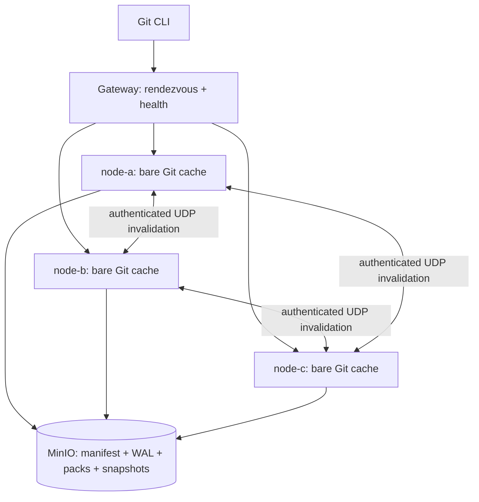

# Continuity Lab architecture

Continuity Lab is an original educational system, not a copy of Cursor internals and not affiliated with Cursor. Local bare Git repositories are disposable caches. MinIO is the sole durable source of truth.

## Fast path and correctness path

The fast path uses a local bare repository, filesystem locking, rendezvous routing, and opportunistic gossip. The correctness path uses immutable content-addressed packs, immutable WAL entries, conditional GET of `head.json`, and a real S3 `PUT If-Match`. Gossip only prompts early catch-up. Every read still establishes freshness against MinIO.

A push creates a normalized non-thin pack from Git's quarantine, uploads it immutably, prepares one real `git update-ref --stdin` transaction, uploads a candidate WAL entry, and conditionally replaces `head.json`. The successful CAS is the commit/visibility boundary. Only then does the hook commit local refs and report `ok` to receive-pack.

A clone/fetch executes `EnsureFresh` during both discovery and upload-pack POST. Missing caches materialize in staging from the current snapshot and committed WAL tail. Existing caches use conditional GET and replay. A final refs comparison and Git connectivity check precede `ready` local state.

## Non-negotiable invariants

Each item below is tested by unit, integration, E2E, concurrency, repair, or chaos coverage (see `scripts/test-e2e.sh`, `scripts/test-chaos.sh`, `tests/integration`, and package tests).

1. MinIO is the source of truth. No local repository can publish authoritative state by itself.
2. A push becomes committed only after the `head.json` CAS succeeds.
3. The server must not report success before the pack, WAL entry, and new `head.json` are durable in MinIO.
4. WAL objects and packs are immutable. Only `head.json` is replaced through CAS.
5. Every committed sequence has one global order within its repository.
6. Two concurrent pushes based on the same previous value of the same ref cannot both win.
7. Concurrent pushes to independent refs may retry and both commit in a serial order.
8. A read that starts after a push completes must observe that push or a later one.
9. Gossip is not part of correctness. Losing every datagram cannot cause data loss or a silently stale read.
10. A local node cache can be deleted completely and rebuilt from a snapshot plus WAL.
11. Pointer publication is the visibility boundary. Packs or entries uploaded before CAS are orphaned objects, not visible commits.
12. Local state must never advance beyond authoritative `head.json`. If detected, it is destroyed and rebuilt.
13. Checksums, paths, and names must be validated before files are materialized.
14. A failure after CAS may produce an uncertain client result, but it cannot undo the authoritative commit.
15. All recovery must be idempotent. Repeating replay, synchronization, or cleanup cannot change the logical result.

## Locking and ordering

Each node has a keyed `sync.RWMutex` and `flock` per repository. Filesystem descriptors remain held while CGI and hooks execute. There is no cross-node lock or leader. Concurrent nodes coordinate solely by the opaque ETag of `head.json`. Same-ref losers become stale; independent-ref losers abort their prepared local transaction, catch up, and retry against the next sequence.

## Storage roots

Committed state is discovered only by reading `repos/<repo-id>/wal/head.json`. LIST is never used to decide visibility. LIST is restricted to grace-period garbage collection. A snapshot is itself visible only after its pointer is installed in `head.json` by CAS.
