# Continuity Lab: guía completa del proyecto

> Traducción al español de la documentación de Continuity Lab.
> La documentación canónica en inglés comienza en [`docs/README.md`](../README.md).

## Índice

1. [Qué es Continuity Lab](#1-qué-es-continuity-lab)
2. [Objetivo y modelo mental](#2-objetivo-y-modelo-mental)
3. [Arquitectura general](#3-arquitectura-general)
4. [Componentes y responsabilidades](#4-componentes-y-responsabilidades)
5. [Modelo de datos autoritativo](#5-modelo-de-datos-autoritativo)
6. [Almacenamiento local desechable](#6-almacenamiento-local-desechable)
7. [Creación de un repositorio](#7-creación-de-un-repositorio)
8. [Flujo completo de un push](#8-flujo-completo-de-un-push)
9. [CAS y pushes concurrentes](#9-cas-y-pushes-concurrentes)
10. [Clone, fetch y lecturas fuertes](#10-clone-fetch-y-lecturas-fuertes)
11. [Materialización y reconstrucción](#11-materialización-y-reconstrucción)
12. [Gossip UDP](#12-gossip-udp)
13. [Snapshots, compactación y GC](#13-snapshots-compactación-y-gc)
14. [Gateway y distribución de tráfico](#14-gateway-y-distribución-de-tráfico)
15. [Consistencia e invariantes](#15-consistencia-e-invariantes)
16. [Modelo de fallos](#16-modelo-de-fallos)
17. [API y CLI](#17-api-y-cli)
18. [Observabilidad](#18-observabilidad)
19. [Configuración](#19-configuración)
20. [Estructura del código](#20-estructura-del-código)
21. [Pruebas](#21-pruebas)
22. [Cómo ejecutar el laboratorio](#22-cómo-ejecutar-el-laboratorio)
23. [Seguridad, límites y no objetivos](#23-seguridad-límites-y-no-objetivos)
24. [Decisiones de diseño](#24-decisiones-de-diseño)

---

## 1. Qué es Continuity Lab

Continuity Lab es un servicio educativo de Git distribuido que implementa el
protocolo **Git Smart HTTP** real. Está compuesto por tres nodos Git cuyos discos
pueden eliminarse y reconstruirse, un gateway y una instancia MinIO que actúa
como almacén de objetos compatible con S3.

No simula Git: ejecuta `git-http-backend`, `git-receive-pack`,
`git-upload-pack`, hooks y comandos de plumbing de Git reales. Tampoco usa una
base de datos externa ni un líder obligatorio para coordinar escrituras.

El proyecto demuestra cómo combinar:

- repositorios bare locales rápidos;
- packs Git normalizados e inmutables;
- un WAL ordenado por repositorio;
- compare-and-swap mediante `PUT If-Match` de S3;
- snapshots completos;
- cachés reconstruibles;
- lecturas fuertes;
- gossip como optimización, nunca como requisito de corrección.

Es un laboratorio local. No está afiliado con Cursor y no contiene código
propietario de Cursor.

## 2. Objetivo y modelo mental

La idea principal puede resumirse así:

```text
MinIO = estado durable y autoritativo
Nodo Git = caché local rápida y desechable
head.json = frontera de commit y visibilidad
WAL = historial ordenado de cambios de refs
Pack = contenido Git inmutable
Snapshot = punto base para reconstrucción rápida
Gossip = aviso anticipado, no fuente de verdad
```

Un repositorio local no es una réplica autoritativa. Si desaparece el volumen de
`node-b`, el sistema debe poder recrearlo usando solamente los objetos visibles
desde MinIO.

### Separación entre corrección y rendimiento

| Camino | Mecanismos | Propósito |
| --- | --- | --- |
| Corrección | MinIO, ETag opaco, CAS de `head.json`, checksums, WAL | Orden, durabilidad y lecturas verificadas |
| Rendimiento | caché bare local, rendezvous hashing, locks locales, gossip | Menos reconstrucciones y menor latencia |

Esta separación permite perder todos los mensajes de gossip o borrar cualquier
caché local sin perder commits confirmados.

## 3. Arquitectura general

### 3.1 Topología de ejecución

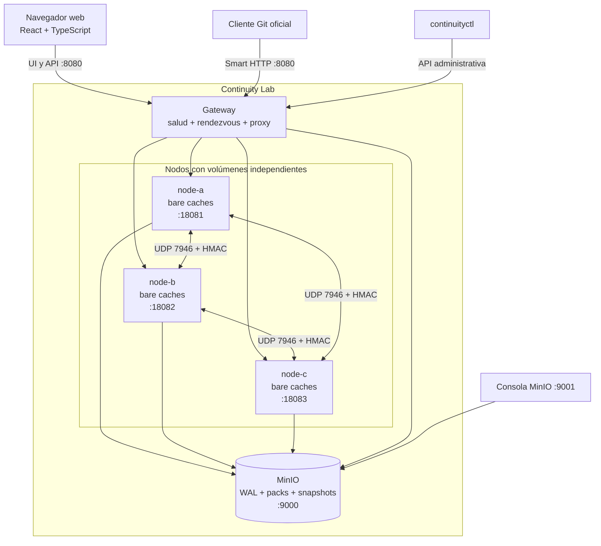

Todos los puertos publicados se enlazan a `127.0.0.1`. Los nodos comparten la
red de Compose, pero **no comparten volúmenes de repositorios**.

### 3.2 Fronteras de autoridad

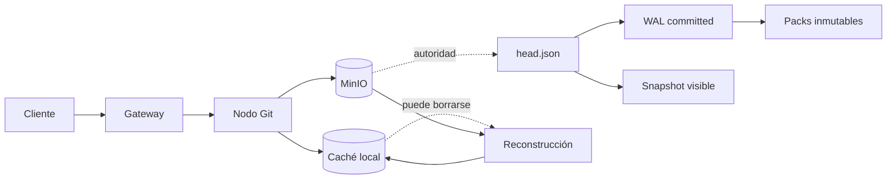

La visibilidad no se determina enumerando objetos. El único punto de entrada al
estado committed es `wal/head.json`. Un pack o una entrada WAL que exista en
MinIO pero no sea alcanzable desde ese archivo es un objeto huérfano.

## 4. Componentes y responsabilidades

### Gateway

El binario `gateway`:

- publica la UI React en `http://localhost:8080/`;
- sirve el bundle frontend embebido y sus deep links `/repos/*` y `/admin/*`;
- publica Smart HTTP en `http://localhost:8080/git/<nombre>.git`;
- crea, enumera e inspecciona repositorios mediante `/api/v1`;
- distribuye consultas de ramas, árboles, blobs y commits hacia nodos sanos;
- comprueba cada segundo la salud de los nodos;
- comprueba que MinIO esté disponible;
- ordena nodos mediante rendezvous hashing por `repo_id`;
- envía writes al primer nodo sano del ranking;
- distribuye reads entre las réplicas sanas mejor posicionadas;
- propaga o genera `X-Request-ID`;
- publica logs JSON y métricas Prometheus.

El gateway no guarda repositorios ni decide el orden de commits.

### Nodos Git

Cada proceso `node`:

- mantiene repositorios bare locales;
- sincroniza cada repositorio con MinIO antes de servirlo;
- ejecuta `git-http-backend` como CGI;
- instala y ejecuta los hooks de Continuity;
- materializa snapshots y reproduce WAL;
- mantiene locks por repositorio;
- envía y recibe gossip UDP autenticado;
- ofrece operaciones de verify, compact, GC y eviction;
- expone salud, métricas y failpoints de laboratorio.

### MinIO

MinIO contiene:

- manifiestos de repositorio;
- el `head.json` mutable protegido por CAS;
- entradas WAL inmutables;
- packs de pushes inmutables y direccionados por contenido;
- metadatos y packs de snapshots;
- objetos huérfanos temporales que un GC posterior puede recoger.

Es la única fuente de verdad durable del laboratorio. El proyecto usa una sola
instancia local; perder su volumen significa perder los datos autoritativos.

### Hooks

| Hook | Responsabilidad |
| --- | --- |
| `pre-receive` | validar comandos, leer cuarentena, producir pack no-thin, validarlo y subirlo |
| `proc-receive` | negociar pkt-line, preparar refs, publicar WAL y ejecutar CAS |
| `post-receive` | comprobar reconciliación local, emitir gossip y disparar snapshot si corresponde |

`receive.procReceiveRefs=refs/` delega **todas** las refs a `proc-receive` para
evitar que `receive-pack` las aplique una segunda vez.

### Interfaz web

La SPA en `web/` usa React y TypeScript y separa dos experiencias. **Continuity
Git**, publicada en `/`, permite crear y filtrar repositorios, seleccionar ramas
o tags, recorrer directorios, leer blobs de texto, previsualizar README y
consultar commits y sus archivos modificados. También incluye un editor
CodeMirror cargado bajo demanda para crear y editar archivos UTF-8. Cada guardado
crea un commit Git real sobre la rama seleccionada y lo publica por Smart HTTP,
por lo que atraviesa los mismos hooks, WAL y CAS que un push externo. Un OID base
obsoleto produce HTTP 409. **Continuity Admin**, publicada en `/admin`, es una
consola operacional de solo lectura con la salud real de los
nodos, el WAL agregado y los registros lógicos autoritativos de MinIO. No muestra
métricas del prototipo que el backend no expone, como tamaño físico, uptime o
lag por secuencia. Los blobs se leen con plumbing Git en un nodo que primero
ejecuta `EnsureFreshRead`; no se accede directamente al volumen desde el
navegador.

Vite genera el bundle en `internal/webui/dist`. Go lo incorpora al binario del
gateway mediante `embed`, por lo que no existe un servidor Node en runtime. El
Dockerfile utiliza Node solamente en una etapa de compilación.

### continuityctl

`continuityctl` es el cliente administrativo. Consume la API del gateway o los
puertos directos de los nodos y también puede ejecutar el contrato de
conformidad S3.

## 5. Modelo de datos autoritativo

### 5.1 Identidad de repositorio

Un nombre como `acme/demo.git` se canonicaliza a `acme/demo`. Se rechazan
separadores codificados, backslashes, segmentos inseguros y nombres inválidos.
El nombre público nunca se usa directamente como ruta local.

```text
repo_id = SHA-256(nombre canónico)
```

Ejemplo:

```text
nombre público: acme/demo
repo_id:        51b27da18999bff38e618463cbbe31da7a73d2563be29dc718f0e94628626baf
ruta local:     /var/lib/continuity/repos/<repo_id>.git
```

### 5.2 Jerarquía de objetos en MinIO

```text
repos/<repo-id>/
├── manifest.json
├── wal/
│   ├── head.json
│   └── entries/
│       ├── 00000000000000000001-<entry-ulid>.json
│       ├── 00000000000000000002-<entry-ulid>.json
│       └── ...
├── packs/
│   └── <sha256>.pack
└── snapshots/
    ├── <snapshot-ulid>.json
    └── <sha256>.pack
```

Los nombres exactos los construye `internal/model/model.go`.

### 5.3 Entidades principales

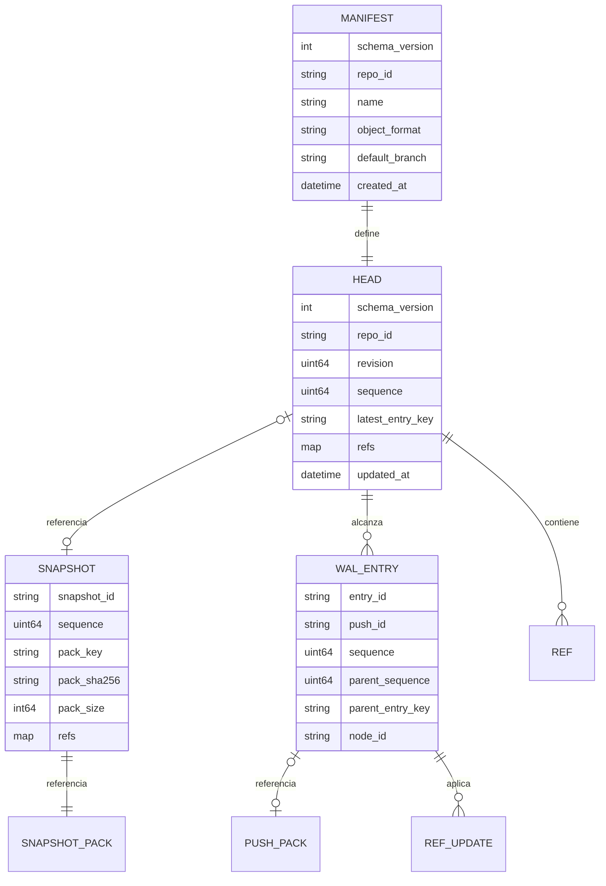

#### Manifest

Es inmutable y registra identidad, nombre canónico, rama por defecto y formato
de objetos. Actualmente el formato soportado es SHA-1.

#### Head

`head.json` contiene el estado visible completo:

- revisión del propio puntero;
- última secuencia committed;
- clave de la entrada WAL más reciente;
- mapa exacto de refs visibles;
- snapshot vigente, si existe;
- fecha de actualización.

Es el único objeto autoritativo que se reemplaza. Cada reemplazo usa el ETag
opaco recibido de MinIO mediante `PUT If-Match`.

#### Entrada WAL

Una entrada incluye:

- secuencia y secuencia padre;
- clave de la entrada padre;
- nodo y push que la generaron;
- actualizaciones `old_oid -> new_oid`;
- pack asociado, su tamaño y SHA-256.

Las entradas forman una cadena hacia atrás desde `head.latest_entry_key`.

#### Snapshot

Un snapshot contiene un pack no-thin con todos los objetos alcanzables y el mapa
completo de refs en una secuencia. Solo es visible cuando un CAS instala su
puntero en `head.json`.

## 6. Almacenamiento local desechable

Cada nodo usa su propio volumen en `/var/lib/continuity`:

```text
/var/lib/continuity/
├── repos/<repo-id>.git/            # repositorios bare
├── state/<repo-id>.json            # estado local verificado
├── locks/                           # flock por repositorio
├── pending/<repo-id>/              # metadata y receipts de pushes
├── staging/                         # materialización y tombstones
├── quarantine-metadata/             # apoyo a hooks
├── failpoints/                       # marcadores once-only en lab mode
└── events/                           # puente de eventos hook -> proceso
```

`state/<repo-id>.json` registra, entre otros datos:

- ETag de manifest y head;
- revisión y secuencia aplicadas;
- último entry key;
- snapshot usado;
- checksum de refs;
- estado local (`ready`, `materializing`, `syncing`, etc.).

Los JSON locales críticos se escriben en un temporal, se hace `fsync`, se
renombran atómicamente y se sincroniza el directorio.

## 7. Creación de un repositorio

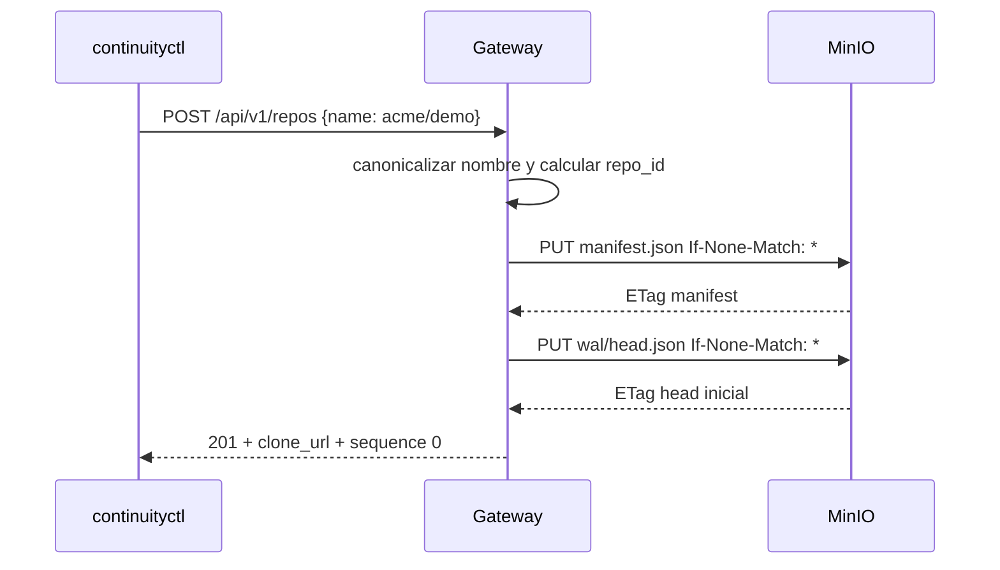

La creación es idempotente si el manifiesto existente coincide. Un conflicto de
identidad o formato se rechaza.

## 8. Flujo completo de un push

### 8.1 Camino principal

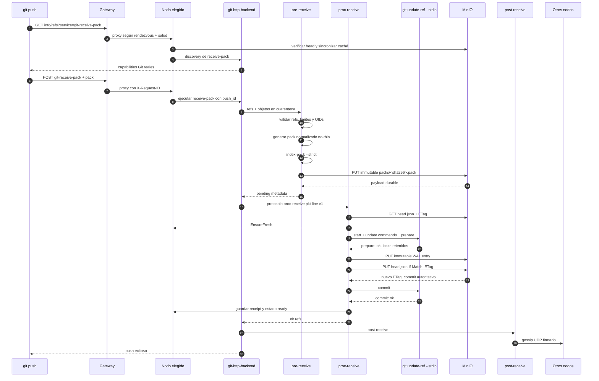

### 8.2 Por qué se normaliza el pack

Los objetos recibidos por Git viven inicialmente en un entorno de cuarentena y
el pack de red puede ser thin. El hook enumera los objetos con plumbing Git y
produce un pack no-thin independiente. Después lo valida con
`git index-pack --stdin --strict` antes de publicarlo.

Esto permite reconstruir un nodo sin depender de objetos que solo existían en la
caché del nodo que recibió el push.

### 8.3 Máquina de estados del push

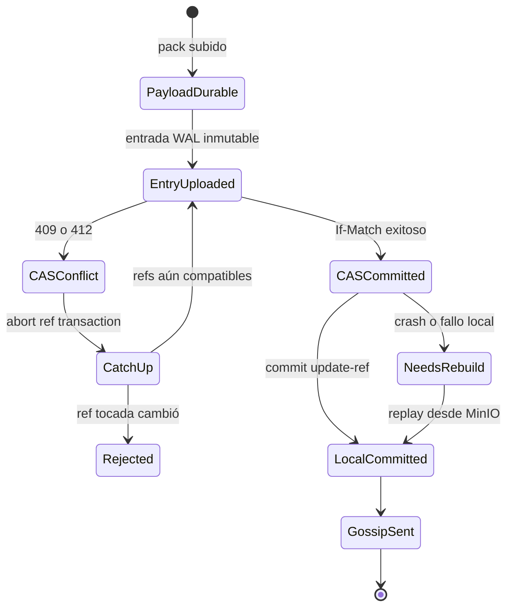

La transición `CASCommitted` es irreversible desde el punto de vista lógico. Un
fallo posterior puede producir una respuesta incierta para el cliente, pero no
puede deshacer el commit autoritativo.

## 9. CAS y pushes concurrentes

No existe un líder de escritura. Cualquier nodo sano puede preparar un push.
Todos compiten por reemplazar el mismo `head.json` usando el ETag observado.
MinIO garantiza que solo un `If-Match` contra ese ETag puede ganar.

### 9.1 Dos pushes sobre la misma ref

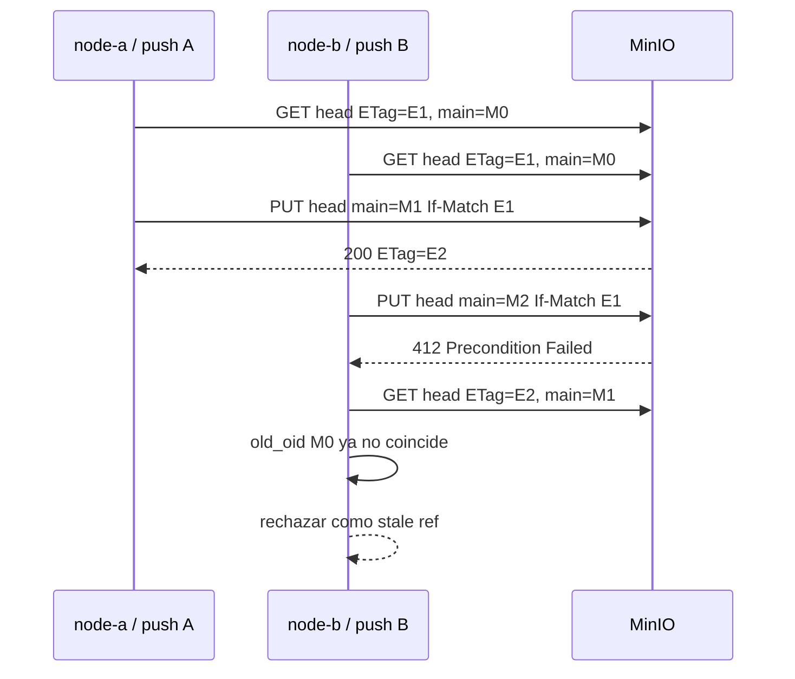

Solo uno puede ganar si ambos parten del mismo OID anterior.

### 9.2 Pushes sobre refs independientes

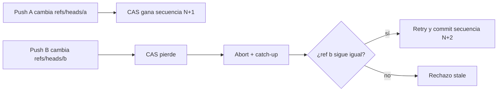

El perdedor sincroniza el estado, comprueba que las refs que toca siguen siendo
compatibles y reintenta con backoff y jitter. Por eso ambos cambios
independientes pueden terminar committed en un orden serial.

## 10. Clone, fetch y lecturas fuertes

El sistema ejecuta `EnsureFreshRead` antes de servir `git-upload-pack`, tanto en
la discovery request como en el POST que transfiere objetos.

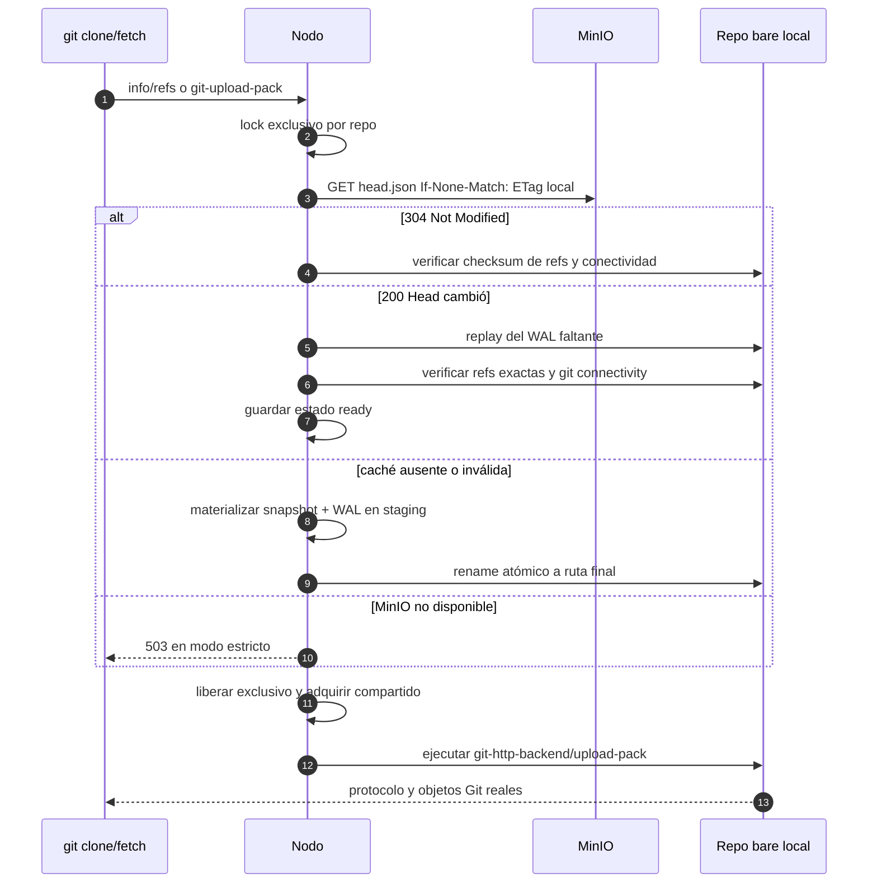

El GET condicional de `head.json` es el punto de linealización de lectura. Una
lectura que comienza después de completarse un push observará ese commit o uno
posterior.

### Lecturas stale opcionales

El valor por defecto es:

```text
CONTINUITY_ALLOW_STALE_READS=false
```

Si se activa, solamente `upload-pack` puede usar una caché previamente verificada
cuando MinIO no está disponible. Antes de servir, todavía se comprueban el
checksum de refs y la conectividad Git. Discovery de receive-pack, pushes y
operaciones de mantenimiento continúan siendo estrictos.

Este modo existe para experimentación; reduce la garantía de frescura durante
una caída del object store.

## 11. Materialización y reconstrucción

### 11.1 Algoritmo

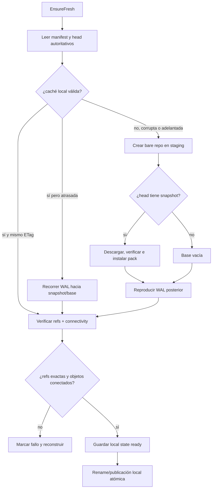

### 11.2 Validaciones

Durante descarga y replay se comprueban:

- repositorio y secuencia esperados;
- cadena padre de cada entrada;
- claves permitidas;
- tamaño y SHA-256 del pack;
- formato de refs y OIDs;
- instalación mediante `index-pack --strict`;
- refs finales exactamente iguales a `head.refs`;
- conectividad de objetos mediante Git.

Si el estado local aparece por delante del head autoritativo, no se intenta
fusionarlo: se elimina y reconstruye.

### 11.3 Eviction

La operación de eviction:

1. adquiere lock exclusivo;
2. rechaza repositorios con requests activos;
3. confirma que MinIO está disponible;
4. renombra la caché a un tombstone en staging;
5. elimina el estado local;
6. elimina el tombstone.

La siguiente lectura materializa nuevamente el repositorio.

## 12. Gossip UDP

Después de un push, `post-receive` envía a sus peers un datagrama JSON de hasta
4 KiB con:

- versión;
- `repo_id`;
- secuencia y revisión observadas;
- ETag de head;
- emisor, timestamp y nonce;
- HMAC-SHA256.

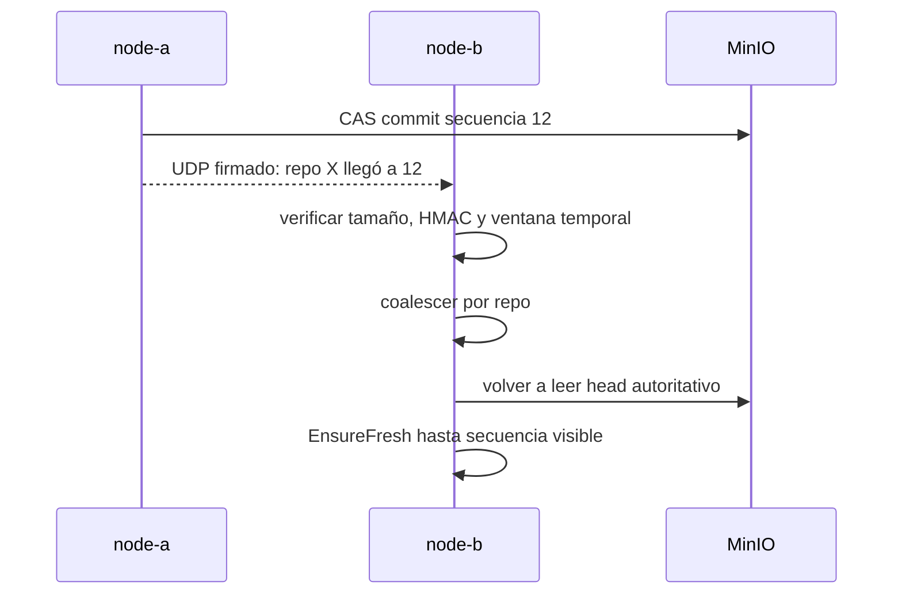

El receptor no confía en el contenido para aplicar refs. El mensaje solo provoca
una lectura anticipada de MinIO. Datagramas perdidos, duplicados o reordenados no
cambian la corrección del sistema.

## 13. Snapshots, compactación y GC

### 13.1 Compactación

Un snapshot se crea manualmente con `repo compact` o automáticamente cuando el
WAL posterior al snapshot supera el umbral de entradas o bytes.

```mermaid
sequenceDiagram
    participant N as Nodo compactor
    participant Git as Git plumbing
    participant S3 as MinIO

    N->>S3: leer head + ETag E1
    N->>N: EnsureFresh y lock exclusivo
    N->>Git: pack-objects de todos los objetos alcanzables
    Git-->>N: pack completo no-thin
    N->>N: validar pack y SHA-256
    N->>S3: PUT immutable snapshot pack
    N->>S3: PUT immutable snapshot metadata
    N->>S3: releer head
    alt head sigue en misma secuencia y ETag
        N->>S3: PUT head con snapshot If-Match E1
        S3-->>N: snapshot visible + nuevo ETag
    else hubo un push concurrente
        N-->>N: abortar publicación; objetos quedan huérfanos
    end
```

La secuencia lógica no aumenta al instalar un snapshot, pero la revisión y ETag
del head sí cambian.

### 13.2 Reconstrucción desde snapshot

La materialización instala primero el pack del snapshot, fija las refs de esa
secuencia y después reproduce únicamente la cola WAL posterior. Sin snapshot,
debe recorrer desde la secuencia cero.

### 13.3 Garbage collection

El GC parte del `head.json` actual y marca como alcanzables:

- manifest y head;
- snapshot vigente y su pack;
- cadena WAL posterior al snapshot;
- packs referenciados por esa cadena.

Después usa LIST solamente para encontrar candidatos no alcanzables. Respeta un
periodo de gracia, permite `--dry-run` y nunca usa LIST para decidir qué estado
es visible.

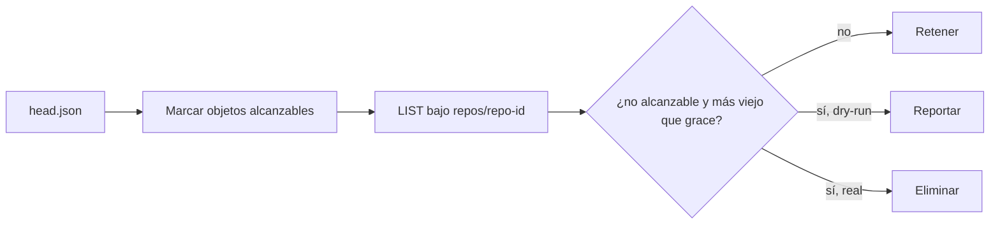

## 14. Gateway y distribución de tráfico

### Rendezvous hashing

Para cada `repo_id`, el gateway calcula un score estable por nodo y ordena los
nodos sanos. Esto proporciona afinidad: normalmente un repositorio vuelve al
mismo nodo y aprovecha su caché caliente.

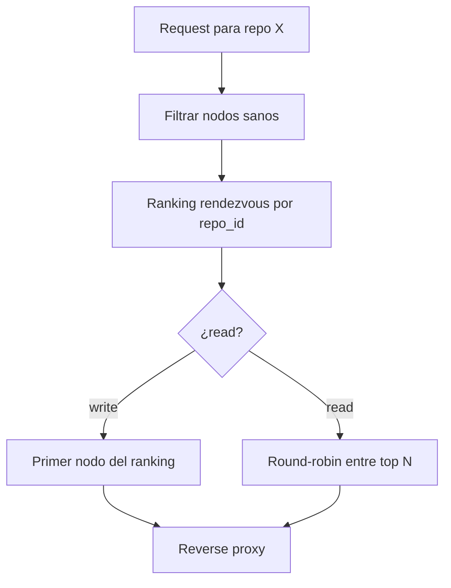

La afinidad no convierte al nodo preferido en líder. Si muere, el gateway usa el
siguiente nodo sano y ese nodo sincroniza o materializa el repositorio.

## 15. Consistencia e invariantes

Las garantías centrales son:

1. MinIO es la única fuente de verdad durable.
2. Un push queda committed únicamente cuando el CAS de `head.json` tiene éxito.
3. Pack y entrada WAL deben ser durables antes del CAS.
4. Packs y entradas WAL son inmutables.
5. Cada repositorio tiene un único orden global de secuencias committed.
6. Dos pushes incompatibles sobre el mismo valor anterior no pueden ganar ambos.
7. Pushes compatibles pueden reintentarse y serializarse.
8. Las lecturas estrictas verifican `head.json` antes de servir.
9. Gossip no participa en la corrección.
10. Un nodo vacío puede reconstruirse desde snapshot y WAL.
11. Objetos pre-CAS no son visibles.
12. Una caché local nunca puede considerarse válida si está adelantada.
13. Rutas, refs, OIDs, tamaños y checksums se validan.
14. Un fallo post-CAS puede dar resultado incierto, pero el commit persiste.
15. Replay, recuperación y cleanup son idempotentes.

### Linealización

```text
WRITE: PUT head.json If-Match exitoso
READ:  GET condicional de head.json
```

El commit local de refs ocurre después del CAS. Si ese paso falla, la caché se
repara desde el estado autoritativo.

## 16. Modelo de fallos

| Falla | Estado autoritativo | Comportamiento |
| --- | --- | --- |
| Antes de subir pack | sin cambios | push falla |
| Pack subido, sin entrada | sin cambios | pack huérfano |
| Entrada subida, sin CAS | sin cambios | entrada y pack huérfanos |
| CAS 409/412 | otro writer ganó | abort, catch-up y retry/reject |
| Crash después de CAS | committed | replay al reiniciar; resultado cliente incierto |
| Gossip perdido | committed | catch-up en próxima lectura |
| Nodo preferido caído | intacto | gateway usa otro nodo |
| Volumen de nodo borrado | intacto | reconstrucción completa |
| Pack local corrupto | intacto | detección, eviction y reconstrucción |
| MinIO temporalmente caído | no verificable | writes fallan; reads estrictos devuelven 503 |
| Pack remoto corrupto | fuente dañada | no servir; error e invariante fallida |
| Volumen MinIO perdido | perdido | pérdida de datos autoritativos |

### Failpoints disponibles

En `CONTINUITY_LAB_MODE=true` se pueden activar marcadores de un solo uso:

```text
after_payload_upload
before_entry_upload
after_entry_upload
before_head_cas
after_head_cas
before_local_ref_commit
after_local_ref_commit
before_http_success
drop_all_gossip
corrupt_next_local_pack
```

`after_head_cas` es especialmente importante: el cliente puede recibir error,
pero el push ya está committed y la recuperación debe converger a él.

## 17. API y CLI

### 17.1 Comandos principales

```sh
./bin/continuityctl storage conformance
./bin/continuityctl cluster status

./bin/continuityctl repo create acme/demo
./bin/continuityctl repo inspect acme/demo
./bin/continuityctl repo refs acme/demo
./bin/continuityctl repo wal acme/demo --limit 10
./bin/continuityctl repo verify acme/demo
./bin/continuityctl repo verify acme/demo --all-nodes
./bin/continuityctl repo compact acme/demo
./bin/continuityctl repo gc acme/demo --dry-run
./bin/continuityctl repo evict acme/demo --node node-b

./bin/continuityctl node cache list --node node-a
./bin/continuityctl failpoint set after_head_cas --node node-a --mode once
./bin/continuityctl failpoint clear after_head_cas --node node-a
```

Se puede añadir `--json` para salida JSON compacta.

### 17.2 Endpoints del gateway

| Método | Ruta | Uso |
| --- | --- | --- |
| GET | `/healthz` | proceso vivo |
| GET | `/readyz` | MinIO y al menos un nodo disponibles |
| GET | `/metrics` | métricas Prometheus |
| GET | `/api/v1/cluster` | estado de nodos |
| GET | `/api/v1/repos` | enumerar repositorios para la UI |
| POST | `/api/v1/repos` | crear repositorio |
| GET | `/api/v1/repos/<name>` | manifest, head y ETag |
| GET | `/api/v1/repos/<name>/refs` | refs autoritativas |
| GET | `/api/v1/repos/<name>/wal` | cadena WAL reciente |
| POST | `/api/v1/repos/<name>/verify` | verificar en nodo elegido |
| POST | `/api/v1/repos/<name>/compact` | publicar snapshot |
| POST | `/api/v1/repos/<name>/gc` | ejecutar GC |
| GET | `/api/v1/browse/<name>?view=refs` | ramas y tags |
| GET | `/api/v1/browse/<name>?view=tree` | árbol de un commit |
| GET | `/api/v1/browse/<name>?view=blob` | blob de texto o metadata binaria |
| GET | `/api/v1/browse/<name>?view=commits` | historial acotado de commits |
| GET | `/api/v1/browse/<name>?view=commit` | detalle y cambios de un commit |
| POST | `/api/v1/edit/<name>` | crear o editar archivo y publicar un commit real |
| GET/POST | `/git/<name>.git/...` | Git Smart HTTP |

### 17.3 Endpoints directos de nodo

Además de salud, métricas y Git:

```text
GET    /api/v1/cache
POST   /api/v1/repos/<name>/verify
POST   /api/v1/repos/<name>/compact
POST   /api/v1/repos/<name>/gc
POST   /api/v1/repos/<name>/evict
PUT    /api/v1/failpoints/<name>
DELETE /api/v1/failpoints/<name>
```

## 18. Observabilidad

### 18.1 Logs estructurados

Gateway, nodos y hooks escriben JSON mediante `slog`. Según la operación pueden
incluir:

```text
timestamp, level, msg, component, node_id,
request_id, push_id, repo_id, repo_name,
sequence, head_revision, head_etag, cas_attempt,
method, path, status, latency_ms, error
```

`X-Request-ID` atraviesa gateway, nodo, CGI y hooks para correlacionar un push.

```sh
make logs
# o

docker compose logs -f gateway node-a node-b node-c
```

### 18.2 Métricas Prometheus

Cada servicio expone `/metrics`. Métricas relevantes:

| Métrica | Significado |
| --- | --- |
| `continuity_git_requests_total` | requests por nodo, servicio y status |
| `continuity_git_request_duration_seconds` | latencia Smart HTTP |
| `continuity_pushes_total` | resultado de pushes |
| `continuity_push_duration_seconds` | duración de pushes |
| `continuity_cas_attempts_total` | success, conflict y error de CAS |
| `continuity_cas_retries_total` | reintentos por conflicto |
| `continuity_local_repos` | cachés por estado |
| `continuity_materializations_total` | materializaciones y resultados |
| `continuity_materialization_duration_seconds` | duración de rebuilds |
| `continuity_replay_entries_total` | entradas WAL reproducidas |
| `continuity_gossip_sent_total` | datagramas enviados |
| `continuity_gossip_received_total` | resultados de recepción |
| `continuity_strong_read_checks_total` | resultados de freshness checks |
| `continuity_compactions_total` | compactaciones |
| `continuity_lock_wait_seconds` | espera de locks shared/exclusive |
| `continuity_invariant_failures_total` | violaciones detectadas |

Ejemplo:

```sh
curl -fsS http://localhost:18081/metrics | grep '^continuity_'
```

Los hooks son procesos cortos, por lo que publican eventos locales que el
proceso persistente del nodo consume y traduce a contadores Prometheus.

## 19. Configuración

Variables principales y valores por defecto:

| Variable | Default | Descripción |
| --- | --- | --- |
| `CONTINUITY_NODE_ID` | nombre de componente | identidad del nodo |
| `CONTINUITY_LISTEN_ADDR` | `:8080` | dirección HTTP interna |
| `CONTINUITY_GATEWAY_URL` | `http://localhost:8080` | URL pública generada |
| `CONTINUITY_DATA_DIR` | `/var/lib/continuity` | raíz local |
| `CONTINUITY_BUCKET` | `continuity-lab` | bucket autoritativo |
| `CONTINUITY_NODES` | tres nodos Compose | miembros del gateway |
| `CONTINUITY_GOSSIP_ADDR` | `:7946` | listener UDP |
| `CONTINUITY_GOSSIP_PEERS` | por nodo | peers UDP |
| `CONTINUITY_GOSSIP_SECRET` | secreto de desarrollo | HMAC de gossip |
| `CONTINUITY_ALLOW_STALE_READS` | `false` | read-only stale fallback |
| `CONTINUITY_CAS_MAX_RETRIES` | `16` | máximo de retries CAS |
| `CONTINUITY_READ_REPLICA_COUNT` | `3` | top N para reads |
| `CONTINUITY_MAX_REFS_PER_PUSH` | `1024` | límite de refs por push |
| `CONTINUITY_RECEIVE_MAX_INPUT_SIZE` | `1073741824` | límite de input receive-pack |
| `CONTINUITY_PENDING_TTL` | `30m` | vigencia de metadata pending |
| `CONTINUITY_LOCK_TIMEOUT` | `2m` | espera máxima de lock |
| `CONTINUITY_SNAPSHOT_ENTRY_THRESHOLD` | `50` | entries antes de snapshot automático |
| `CONTINUITY_SNAPSHOT_BYTE_THRESHOLD` | `268435456` | bytes antes de snapshot automático |
| `CONTINUITY_GC_GRACE_PERIOD` | `1h` | antigüedad mínima para GC |
| `CONTINUITY_LAB_MODE` | `false` en código | habilita failpoints |
| `S3_ENDPOINT` | `http://localhost:9000` | endpoint S3/MinIO |
| `S3_REGION` | `us-east-1` | región S3 |
| `S3_FORCE_PATH_STYLE` | `true` | addressing compatible con MinIO |
| `MINIO_ROOT_USER` | `continuity` | credencial local |
| `MINIO_ROOT_PASSWORD` | contraseña local pública | credencial local |
| `MINIO_IMAGE` | release fijado | imagen MinIO sustituible |

Compose activa `CONTINUITY_LAB_MODE=true` deliberadamente. Las credenciales y el
secreto incluidos son solo para desarrollo local.

## 20. Estructura del código

```text
.
├── cmd/
│   ├── gateway/              # entrada del reverse proxy/API
│   ├── node/                 # entrada del nodo Git
│   ├── continuity-hook/      # dispatcher de hooks
│   └── continuityctl/        # CLI administrativa
├── web/                      # SPA React + TypeScript + Vite
├── hooks/                    # wrappers instalados en repos bare
├── internal/
│   ├── admin/                # create/inspect sobre object store
│   ├── config/               # carga y validación de configuración
│   ├── failpoint/            # failpoints del laboratorio
│   ├── gateway/              # routing, salud y proxy
│   ├── gitbackend/           # puente CGI a git-http-backend
│   ├── gitbrowse/            # lectura segura de refs, árboles, blobs y commits
│   ├── githooks/
│   │   ├── pktline/          # codec pkt-line estricto
│   │   ├── prereceive/       # pack durable desde quarantine
│   │   ├── procreceive/      # transacción WAL/CAS
│   │   └── postreceive/      # gossip y snapshot trigger
│   ├── gossip/               # UDP, HMAC, coalescing y catch-up
│   ├── health/               # healthz/readyz
│   ├── locks/                # RWMutex + flock por repo
│   ├── model/                # esquemas, claves y validación
│   ├── node/                 # HTTP del nodo
│   ├── objectstore/          # interfaz S3 y conformidad
│   ├── observability/        # logs, métricas y eventos
│   ├── repository/           # materialización, replay y verify
│   ├── routing/              # rendezvous hashing
│   ├── snapshot/             # compactación y GC
│   ├── wal/                  # prepare/CAS/commit y retries
│   ├── webedit/              # commits del editor y push Smart HTTP
│   └── webui/                # bundle React embebido en gateway
├── scripts/                  # bootstrap, demo y pruebas reales
├── tests/integration/        # integración Git + MinIO
├── deploy/                   # Dockerfile y Compose completo
├── docs/                     # arquitectura, protocolo, ADR y operaciones
├── Makefile
└── IMPLEMENTATION_STATUS.md
```

### Dependencias conceptuales

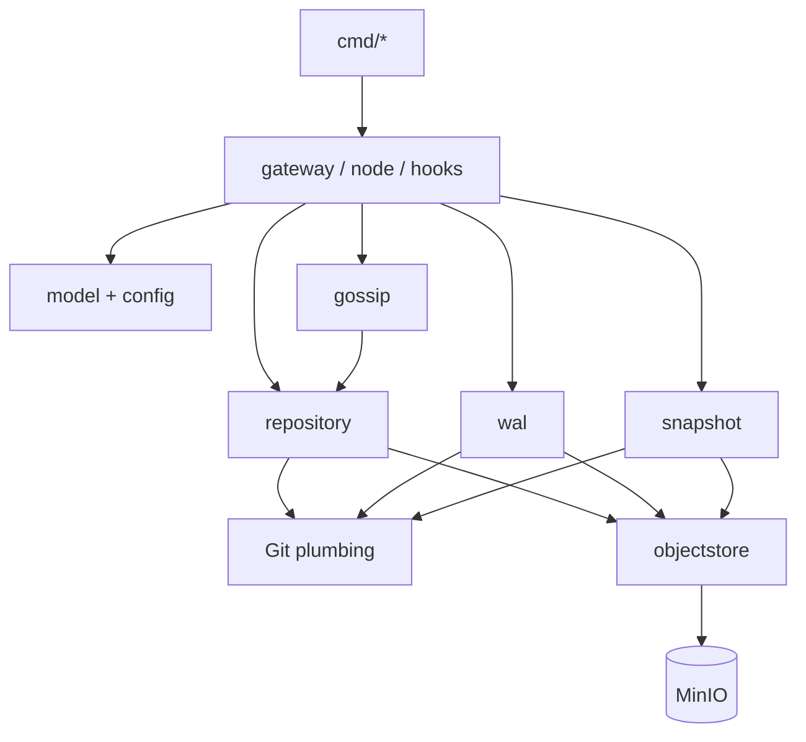

## 21. Pruebas

### 21.1 Matriz

| Target | Qué verifica |
| --- | --- |
| `make test-unit` | modelos, pkt-line, failpoints, gossip, snapshots, routing |
| `make test-race` | paquetes internos con detector de carreras |
| `make test-integration` | Git real, cuarentena, packs y MinIO real |
| `make test-ui` | type-check, build y flujo UI/API sobre un repositorio real |
| `make test-multiarch` | binarios y manifests linux/amd64 + linux/arm64 |
| `make test-stale` | stale read permitido y write estricto |
| `make test-e2e` | clone/fetch/push, tags, force, 100 commits y tres nodos |
| `make test-chaos` | failpoints, corrupción, gossip loss, fallback y MinIO outage |
| `make test-all` | toda la batería anterior más `go vet` |
| `make demo` | demostración reproducible y verificable |

### 21.2 Concurrencia

La suite lanza pushes reales contra nodos diferentes:

- 20 actualizaciones de refs independientes: deben terminar `20/20`;
- 20 competidores sobre la misma ref y el mismo old OID: debe ganar exactamente
  `1/20`.

### 21.3 Gate completo

El gate de aceptación desde estado limpio es:

```sh
make reset && make bootstrap && make test-all && make demo
```

El estado y la evidencia de cada fase se documentan en
[`IMPLEMENTATION_STATUS.md`](../../IMPLEMENTATION_STATUS.md).

### 21.4 Microbenchmark

```sh
go test -run '^$' -bench BenchmarkRankThreeNodes -benchmem ./internal/routing
```

Solo detecta regresiones básicas del ranking rendezvous. No representa capacidad
productiva ni mide throughput de Git o MinIO.

## 22. Cómo ejecutar el laboratorio

### Requisitos

- Docker con Compose v2;
- Git instalado en el host;
- Go 1.26.x para builds en el host;
- Node.js 24 y npm para compilar la UI en el host;
- puertos 8080, 9000, 9001 y 18081-18083 libres.

### Inicio

```sh
make bootstrap
./bin/continuityctl cluster status
```

Después de iniciar, la interfaz web está disponible en
**<http://localhost:8080>**.

Servicios:

| Servicio | URL |
| --- | --- |
| Gateway | `http://localhost:8080` |
| MinIO API | `http://localhost:9000` |
| MinIO Console | `http://localhost:9001` |
| node-a | `http://localhost:18081` |
| node-b | `http://localhost:18082` |
| node-c | `http://localhost:18083` |

### Ejemplo Git real

```sh
./bin/continuityctl repo create acme/demo

tmp="$(mktemp -d)"
git init -b main "$tmp/source"
git -C "$tmp/source" config user.name 'Continuity Lab'
git -C "$tmp/source" config user.email lab@example.test
printf 'hola\n' > "$tmp/source/README.md"
git -C "$tmp/source" add README.md
git -C "$tmp/source" commit -m 'primer commit'
git -C "$tmp/source" remote add origin \
  http://localhost:8080/git/acme/demo.git
git -C "$tmp/source" push -u origin main

git clone http://localhost:8080/git/acme/demo.git "$tmp/clone"
git -C "$tmp/clone" fsck --full
```

### Inspección y recuperación

```sh
./bin/continuityctl repo inspect acme/demo
./bin/continuityctl repo wal acme/demo
./bin/continuityctl repo verify acme/demo --all-nodes
./bin/continuityctl repo compact acme/demo
./bin/continuityctl repo evict acme/demo --node node-b

git clone http://localhost:18082/git/acme/demo.git "$tmp/rematerialized"
git -C "$tmp/rematerialized" fsck --full
```

### Limpieza

```sh
make reset
```

Este comando elimina contenedores y volúmenes del laboratorio, incluido el
volumen autoritativo de MinIO.

## 23. Seguridad, límites y no objetivos

Continuity Lab no proporciona:

- autenticación ni autorización;
- TLS;
- transporte SSH;
- Git LFS;
- repositorios con object format SHA-256;
- replicación del object store;
- despliegue multi-región;
- interfaz de forge, pull requests, issues o CI;
- cuotas productivas, rate limiting o hardening para Internet.

Las API administrativas y failpoints están expuestos localmente. El editor web
también puede publicar commits directamente en ramas y no tiene control de
acceso. Acepta únicamente archivos regulares UTF-8 de hasta 4 MiB; tags, binarios,
symlinks y rutas `.git` son de solo lectura o se rechazan. Compose usa credenciales
conocidas. Nunca debe publicarse este laboratorio directamente en Internet.

Los bins y las imágenes se validan para Linux amd64 y arm64. Esto no sustituye
una prueba física completa en cada plataforma de escritorio.

## 24. Decisiones de diseño

### Por qué MinIO y no los nodos

Si los nodos fueran autoritativos, habría que resolver replicación de objetos,
quórum, elección de líder y recuperación de divergencias. Al convertirlos en
cachés, la durabilidad se concentra en una interfaz S3 comprobable.

### Por qué CAS en vez de líder

El ETag de `head.json` ya proporciona exclusión optimista por repositorio. Los
nodos pueden escribir sin una coordinación adicional y los conflictos se
resuelven por retry o stale-ref rejection.

### Por qué `proc-receive`

Permite retener una transacción real de `git update-ref --stdin` en estado
prepared mientras se publica el estado autoritativo. Después del CAS se hace
commit local; antes de él todavía puede abortarse.

### Por qué packs completos y no archivos del repo

Los packs son objetos Git verificables, direccionables por contenido e
independientes del layout interno de una caché concreta. No se extraen archivos
de un archive arbitrario.

### Por qué gossip no decide nada

UDP puede perder, duplicar o reordenar mensajes. Usarlo solo como invalidación
anticipada conserva rendimiento sin convertir una red no confiable en parte de
la garantía de consistencia.

### Documentación relacionada

- [Índice de documentación en inglés](../README.md)
- [Arquitectura resumida](../architecture.md)
- [Protocolo](../protocol.md)
- [Modelo de fallos](../failure-model.md)
- [Operaciones](../operations.md)
- [ADR 0001: imagen MinIO](../adr/0001-minio-image.md)
- [ADR 0002: CAS sin líder](../adr/0002-cas-without-leader.md)
- [ADR 0003: atomicidad con proc-receive](../adr/0003-proc-receive-atomicity.md)

---

## Resumen final

Continuity Lab mantiene una separación estricta entre datos autoritativos y
cachés de ejecución. Git conserva su protocolo y herramientas reales; MinIO
aporta objetos inmutables y un CAS; el WAL aporta orden; los snapshots reducen
el costo de reconstrucción; los locks protegen cada caché; el gateway mejora la
localidad; y gossip acelera la convergencia sin intervenir en la corrección.

El resultado es un laboratorio donde cualquier nodo Git puede desaparecer y
volver a construirse, mientras los commits ya publicados siguen definidos por
una única cadena autoritativa alcanzable desde `head.json`.
